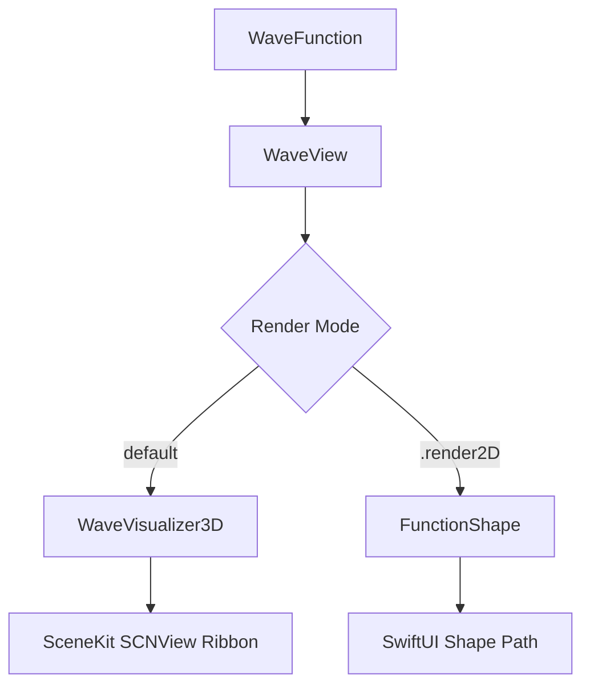

# WaveKit 🌊

A lightweight, powerful, and highly customizable Swift Package for rendering mathematical wave functions in SwiftUI. Renders glowing, hardware-accelerated **3D SceneKit ribbon visualizers** by default, with a **2D vector shape** mode available as an opt-out.

---

## Features

- 🧮 **Any Mathematical Function**: Render arbitrary equations mapping `Double → Double` via closures.
- 🎛️ **SwiftUI Native Modifiers**: A small set of grouped, struct-based modifiers cover styling, animation, grid, drop lines, and camera — no need to chain a dozen calls for one visual decision.
- 🎚️ **Wave Composition**: Compose complex waves using operator overloads like `+`, `-`, and `*` (e.g., superposition, amplitude modulation). This is also how you build specialized looks (ECG-style, pure tones, etc.) — see [Composing Custom Wave Shapes](#composing-custom-wave-shapes).
- 🎨 **Preset Waveforms**: Built-in presets including Sine, Cosine, Triangle, Square, Sawtooth, Damped Oscillation, and Gaussian Bell curves.
- 🔌 **3D by Default**: `WaveView` renders a glowing SceneKit ribbon out of the box — no flag needed. Drop to 2D with a single `.render2D()` when you want a flat vector path instead.
- 🎯 **Match Play & Interference**: Compare a target waveform against the primary wave, with alignment transitions and interference visualization, via one `.interference(with:)` modifier.
- 📦 **Zero External Dependencies**: Built entirely on standard system frameworks (`SwiftUI`, `SceneKit`, `Combine`, and `QuartzCore`).

---

## Table of Contents
1. [Installation](#installation)
2. [Architecture Overview](#architecture-overview)
3. [Quick Start](#quick-start)
4. [Composing Custom Wave Shapes](#composing-custom-wave-shapes)
5. [2D vs 3D Rendering Modes](#2d-vs-3d-rendering-modes)
6. [Complete API Reference](#complete-api-reference)
7. [Migrating from Pre-1.0 Modifiers](#migrating-from-pre-10-modifiers)
8. [Included Examples & Demos](#included-examples--demos)
9. [Simulator Target Troubleshooting](#simulator-target-troubleshooting)

---

## Installation

Add `WaveKit` to your project using Swift Package Manager.

### Xcode Package Dependency
Go to `File` → `Add Packages...` and enter the repository path:
```text
https://github.com/kartikkaushikk/SwiftWaveKit.git
```

### Package.swift
Add it as a dependency in your package manifest:
```swift
dependencies: [
    .package(url: "https://github.com/kartikkaushikk/SwiftWaveKit", from: "0.1.1")
]
```
Then add the library target to your dependencies:
```swift
.product(name: "WaveKit", package: "WaveKit")
```

---

## Architecture Overview

WaveKit is designed around a clean separation between mathematical logic and rendering pipelines:



### Core Components
1. **`WaveFunction`** ([WaveFunction.swift]( WaveKit/Sources/WaveKit/WaveFunction.swift))
   - A wrapper around a `@Sendable (Double) -> Double` closure.
   - Handles math operations and function composition via operator overloads.
2. **`FunctionShape`** ([FunctionShape.swift]( WaveKit/Sources/WaveKit/FunctionShape.swift))
   - A SwiftUI `Shape` that samples the `WaveFunction` over a specific x-range, mapping coordinates to `Path` points for native 2D drawing. Used only when `.render2D()` is applied.
3. **`WaveVisualizer3D`** ([WaveVisualizer3D.swift]( WaveKit/Sources/WaveKit/WaveVisualizer3D.swift))
   - A SceneKit-backed coordinate mapper that renders waveforms as glowing 3D triangle-strip ribbons with a configurable perspective grid, drop lines, and camera. This is the default rendering path.
4. **`WaveView`** ([WaveView.swift]( WaveKit/Sources/WaveKit/WaveView.swift))
   - The primary unified public entry point. It reads customization from the SwiftUI environment and routes between 3D (default) and 2D rendering.

---

## Quick Start

### 1. Zero Config — Looks Finished Out of the Box
```swift
import SwiftUI
import WaveKit

struct SimpleView: View {
    var body: some View {
        WaveView(.sine)
            .frame(height: 300)
    }
}
```
This alone renders an animated, glowing 3D ribbon with a sensible camera angle and grid — no modifiers required.

### 2. Typical Customization
```swift
WaveView(.sine)
    .waveform(amplitude: 1.5, frequency: 2.0)
    .waveStyle(.neon)
    .animated(speed: 1.5)
    .frame(height: 300)
```

### 3. Custom Closure Wave Function
```swift
let customWave = WaveFunction { x in
    sin(x) * cos(2 * x)
}

WaveView(customWave)
    .waveStyle(.init(color: .purple, opacity: 0.9, glowIntensity: 0.6))
    .frame(height: 250)
```

### 4. Opting Out to 2D
```swift
WaveView(.sine)
    .waveform(amplitude: 1.0, frequency: 3.0)
    .waveStyle(.init(color: .cyan))
    .render2D() // flat SwiftUI vector path instead of the 3D ribbon
    .frame(height: 300)
```

---

## Composing Custom Wave Shapes

Earlier versions of WaveKit had dedicated flags like `.isECG(true)` for specific "looks." These were removed — they were style presets pretending to be part of the core API, and they capped what the library could express to whatever a handful of hardcoded flags anticipated.

Instead, build the shape you want using `WaveFunction`'s operator overloads and presets, then style it:

```swift
// ECG-style heartbeat ribbon
let ecgLike = WaveFunction.sine * 0.3 + WaveFunction.gaussian(width: 0.1)

WaveView(ecgLike)
    .waveStyle(.init(color: .green, glowIntensity: 0.8))
```

```swift
// Pure tone (single frequency, no composite harmonics)
WaveView(.sine)
    .waveform(amplitude: 1.0, frequency: 2.0)
```

More recipes live in [Included Examples & Demos](#included-examples--demos) — contributions of new `WavePreset` entries are welcome.

---

## 2D vs 3D Rendering Modes

3D is the default; 2D is the explicit opt-out via `.render2D()`.

| Capability | 3D SceneKit Mode (default) | 2D Vector Mode (`.render2D()`) |
|---|---|---|
| **Render Target** | SceneKit hardware-accelerated 3D mesh | SwiftUI Vector `Path` |
| **Styling** | Glowing neon emission shaders (`.waveStyle`) | Stroke colors & gradients (`.waveStyle`) |
| **Glow / Bloom** | `glowIntensity` on `WaveStyle` | Not applicable |
| **Grid / Drop Lines** | `.gridStyle()`, `.dropLineStyle()` | Not applicable |
| **Camera** | `.cameraAngle()` | Not applicable |
| **Interference** | 3D ribbon alignment and drop-line overlay | Layered overlay views |
| **Progress** | Dynamic Z-depth segment limitation | SwiftUI clipped masks |

> [!NOTE]
> Rendering 3D by default means every `WaveView` spins up an `SCNView`. If you're placing many wave instances in a list or dashboard, consider `.render2D()` for those — see [Simulator Target Troubleshooting](#simulator-target-troubleshooting) and open issues for ongoing perf notes.

---

## Complete API Reference

WaveKit uses SwiftUI environment keys under the hood, but the public surface is a small set of grouped modifiers.

### Wave Shape
- **`.waveform(amplitude:frequency:phase:)`**: Sets vertical scale, horizontal scale, and phase offset together. Defaults: `amplitude: 1.0`, `frequency: 1.0`, `phase: 0.0`.
- **`.xRange(_ range: ClosedRange<Double>)`**: Domain the function is evaluated over. Defaults to `0...2π` (2D mode only).
- **`.sampleCount(_ count: Int)`**: Resolution of the rendered path. Defaults to `200` (2D mode only).
- **`.verticalOffset(_ offset: Double)`**: Translates the wave vertically in amplitude units. Defaults to `0.0`.

### Style
- **`.waveStyle(_ style: WaveStyle)`**: Controls color, line width, opacity, glow intensity, and gradient in one call.
  ```swift
  struct WaveStyle {
      var color: Color = .primary
      var lineWidth: CGFloat = 2
      var opacity: Double = 1.0
      var glowIntensity: Double = 0.0
      var gradient: WaveGradient? = nil
  }
  ```
  Presets: `.neon`, `.minimal`.

### Animation
- **`.animated(speed: Double? = 1.0)`**: Toggles continuous phase-shift animation and sets its speed multiplier. Pass `nil` or `false` to disable.

### 3D Grid & Drop Lines
- **`.gridStyle(_ style: WaveGridStyle)`**: Controls the perspective floor grid — color, line width, opacity, and line count. `lineCount: 0` hides the grid entirely.
- **`.dropLineStyle(_ style: WaveDropLineStyle)`**: Controls the vertical drop lines connecting the ribbon to the base — same fields, independent of grid. `lineCount: 0` hides drop lines entirely.

  Grid and drop lines are independent — you can show one without the other. Presets: `.subtle`, `.dense` (on both types).

### Camera
- **`.cameraAngle(_ config: WaveCameraConfig)`**: Sets azimuth, elevation, and distance for the 3D camera.
  ```swift
  struct WaveCameraConfig {
      var azimuth: Double = 0.0
      var elevation: Double = 15.0
      var distance: Double = 10.0
  }
  ```
  Presets: `.front`, `.iso` (default).

### Progress & Mode
- **`.progress(_ value: Double)`**: Limits the portion of the 3D wave generated along the Z-depth axis (`0.0` to `1.0`). Defaults to `1.0`.
- **`.render2D()`**: Opts out of the default 3D rendering in favor of a flat SwiftUI vector path.

### Target Matching & Interference
- **`.interference(with target: TargetWave?)`**: Renders a secondary comparison wave alongside the primary one. Passing `nil` disables it — no separate show/hide flag.
  ```swift
  struct TargetWave {
      var function: WaveFunction
      var amplitude: Double = 1.0
      var frequency: Double = 1.0
      var phase: Double = 0.0
      var color: Color = .white
      var isAligning: Bool = false
  }
  ```

---

## Included Examples & Demos

The library package includes an executable suite (`WaveKitExample`) with a premium, glassmorphic dark-mode dashboard showcasing 8 visualization demos:

1. **Basic Sine** ([BasicSineDemo.swift]( WaveKit/Example/WaveKitExampleUI/Demos/BasicSineDemo.swift))
   - A single cyan sine wave showcasing `.waveform()` and `.waveStyle()`.
2. **Multiple Waves** ([MultipleWavesDemo.swift]( WaveKit/Example/WaveKitExampleUI/Demos/MultipleWavesDemo.swift))
   - Composite wave superposition showing the sum of two independent frequencies (`+` operator composition).
3. **Damped Decay** ([DampedWaveDemo.swift]( WaveKit/Example/WaveKitExampleUI/Demos/DampedWaveDemo.swift))
   - Simulates a damped oscillator losing energy over distance (`WaveFunction.damped` preset).
4. **Ocean & Interference** ([OceanEffectDemo.swift]( WaveKit/Example/WaveKitExampleUI/Demos/OceanEffectDemo.swift))
   - Renders a primary and target wave via `.interference(with:)`. Tapping "Overlap" triggers `isAligning` to slide them together.
5. **3D ECG Heartbeat** ([ECGStyleDemo.swift](WaveKit/Example/WaveKitExampleUI/Demos/ECGStyleDemo.swift))
   - A scrolling green glowing ribbon mimicking a heartbeat, built by composing `WaveFunction` presets rather than a dedicated flag — see [Composing Custom Wave Shapes](#composing-custom-wave-shapes).
6. **Loading Indicators** ([LoadingIndicatorDemo.swift]( WaveKit/Example/WaveKitExampleUI/Demos/LoadingIndicatorDemo.swift))
   - Shows rhythmic amplitude pulses and 3D card spins powered by SwiftUI timers and modifiers.
7. **Z-Depth Progress** ([ProgressWaveDemo.swift]( WaveKit/Example/WaveKitExampleUI/Demos/ProgressWaveDemo.swift))
   - Controls progress rendering from `0%` to `100%` via `.progress()`.
8. **AM Modulation** ([WaveQuestLevel5Demo.swift]( WaveKit/Example/WaveKitExampleUI/Demos/WaveQuestLevel5Demo.swift))
   - Standard AM radio envelope superposition created by multiplying carrier and modulator wave functions (`*` operator composition).

---

## Simulator Target Troubleshooting

### BKSHIDEvent Bundle ID Crash
When compiling the raw command-line executable package targets (`WaveKitExample`) and launching them directly in the iOS Simulator (without wrapping them in an `.app` bundle first), UIKit event loops will crash with a missing bundle ID error.

**Error Message:**
```text
failure in void __BKSHIDEvent__BUNDLE_IDENTIFIER_FOR_CURRENT_PROCESS_IS_NIL__ ... missing bundleID for main bundle NSBundle
```

**How We Fix It:**
We've included an Objective-C runtime swizzling workaround in `WaveKitExampleApp.swift`. At launch on Simulator targets, it exchanges the `Bundle.main.bundleIdentifier` getter to return a dummy identifier:
```swift
#if targetEnvironment(simulator)
extension Bundle {
    static func enableSimulatorBundleIdWorkaround() {
        // Swizzles bundleIdentifier on Bundle to return "com.example.WaveKitExample" when nil
    }
}
#endif
```
This workaround is enabled automatically when running in simulation mode, preventing the crash.

---

## License

This package is licensed under the MIT License.
