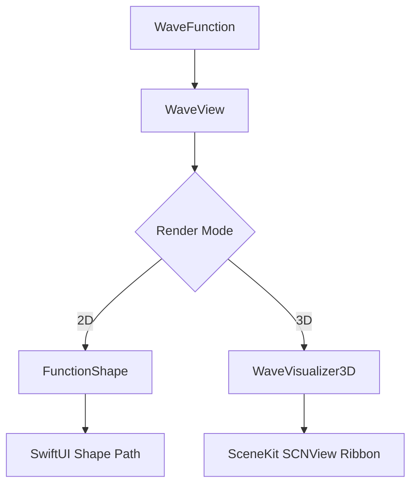

# WaveKit 🌊

A lightweight, powerful, and highly customizable Swift Package for rendering mathematical wave functions in SwiftUI. Natively supports both smooth **2D vector shape plotting** and hardware-accelerated, glowing **3D SceneKit ribbon visualizers**.

---

## Features

- 🧮 **Any Mathematical Function**: Render arbitrary equations mapping `Double → Double` via closures.
- 🎛️ **SwiftUI Native Modifiers**: Customize styling using environment-driven modifiers (amplitude, frequency, line width, animation speed, color, gradients, and offsets).
- 🎚️ **Wave Composition**: Compose complex waves using operator overloads like `+`, `-`, and `*` (e.g., superposition, amplitude modulation).
- 🎨 **Preset Waveforms**: Built-in presets including Sine, Cosine, Triangle, Square, Sawtooth, Damped Oscillation, and Gaussian Bell curves.
- 🔌 **Native 3D SceneKit Ribbon Rendering**: Render floating glowing ribbons in 3D using `.renderMode3D(true)`, with perspective grids and depth drop-lines.
- 🎯 **Match Play & Interference**: Support for comparing target and user waveforms, alignment transition animations, and interference visualizations.
- 📦 **Zero External Dependencies**: Built entirely on standard system frameworks (`SwiftUI`, `SceneKit`, `Combine`, and `QuartzCore`).

---

## Table of Contents
1. [Installation](#installation)
2. [Architecture Overview](#architecture-overview)
3. [Quick Start](#quick-start)
4. [2D vs 3D Rendering Modes](#2d-vs-3d-rendering-modes)
5. [Complete API Reference](#complete-api-reference)
6. [Included Examples & Demos](#included-examples--demos)
7. [Simulator Target Troubleshooting](#simulator-target-troubleshooting)

---

## Installation

Add `WaveKit` to your project using Swift Package Manager.

### Xcode Package Dependency
Go to `File` → `Add Packages...` and enter the repository path:
```text
https://github.com/discombobulated-otter/SwiftWaveKit.git
```

### Package.swift
Add it as a dependency in your package manifest:
```swift
dependencies: [
    .package(url: "https://github.com/discombobulated-otter/SwiftWaveKit", from: "0.1.1")
]
```
Then add the library target to your dependencies:
```swift
.product(name: "WaveKit", package: "WaveKit")
```

---

## Architecture Overview

WaveKit is designed around a clean separation between mathematical logic and rendering pipelines:



### Core Components
1. **`WaveFunction`** ([WaveFunction.swift](file:///Users/kartik/Desktop/WaveKit/Sources/WaveKit/WaveFunction.swift))
   - A wrapper around a `@Sendable (Double) -> Double` closure.
   - Handles math operations and function composition via operator overloads.
2. **`FunctionShape`** ([FunctionShape.swift](file:///Users/kartik/Desktop/WaveKit/Sources/WaveKit/FunctionShape.swift))
   - A SwiftUI `Shape` that samples the `WaveFunction` over a specific x-range, mapping coordinates to `Path` points for native 2D drawing.
3. **`WaveVisualizer3D`** ([WaveVisualizer3D.swift](file:///Users/kartik/Desktop/WaveKit/Sources/WaveKit/WaveVisualizer3D.swift))
   - A SceneKit-backed coordinate mapper that renders waveforms as glowing 3D triangle-strip ribbons with trailing slices fading into the background.
4. **`WaveView`** ([WaveView.swift](file:///Users/kartik/Desktop/WaveKit/Sources/WaveKit/WaveView.swift))
   - The primary unified public entry point. It reads customization from the SwiftUI environment and toggles between 2D and 3D rendering modes dynamically.

---

## Quick Start

### 1. Rendering a Basic Preset Sine Wave (2D)
```swift
import SwiftUI
import WaveKit

struct SimpleView: View {
    var body: some View {
        WaveView(.sine)
            .amplitude(1.5)
            .frequency(2.0)
            .waveColor(.blue)
            .waveLineWidth(3)
            .frame(height: 200)
    }
}
```

### 2. Custom Closure Wave Function
```swift
let customWave = WaveFunction { x in
    sin(x) * cos(2 * x)
}

WaveView(customWave)
    .waveColor(.purple)
    .animated(true)
    .animationSpeed(1.5)
    .frame(height: 250)
```

### 3. Activating Native 3D Rendering Mode
```swift
WaveView(.sine)
    .amplitude(1.0)
    .frequency(3.0)
    .waveColor(.cyan)
    .renderMode3D(true) // Turns the 2D path into a 3D ribbon
    .frame(height: 300)
```

---

## 2D vs 3D Rendering Modes

WaveKit's unified API lets you toggle rendering backends dynamically:

| Capability | 2D Vector Mode (`.renderMode3D(false)`) | 3D SceneKit Mode (`.renderMode3D(true)`) |
|---|---|---|
| **Render Target** | SwiftUI Vector `Path` | SceneKit hardware-accelerated 3D mesh |
| **Styling** | Stroke Colors & Gradients | Glowing neon emission shaders |
| **Glow / Bloom** | SwiftUI Shadow modifiers | High-pass SceneKit post-process Bloom |
| **Interference** | Layered overlay views | 3D ribbon alignment and drop-line overlay |
| **Damping** | Computed via math closure | Dynamic Z-axis depth damping |
| **Progress** | SwiftUI Clipped masks | Dynamic Z-depth segment limitation |

---

## Complete API Reference

WaveKit uses SwiftUI environment keys to pass parameters down the view tree. You can configure any `WaveView` with the following modifiers:

### General Customization
- **`.amplitude(_ value: Double)`**: Sets the vertical scale. Defaults to `1.0`.
- **`.frequency(_ value: Double)`**: Sets the horizontal scaling factor. Defaults to `1.0`.
- **`.phase(_ value: Double)`**: Sets the static phase offset in radians. Defaults to `0.0`.
- **`.xRange(_ range: ClosedRange<Double>)`**: Evaluates the function over this range. Defaults to `0...2π` (only affects 2D mode).
- **`.sampleCount(_ count: Int)`**: Sets the number of coordinate points. Defaults to `200` (only affects 2D mode).
- **`.waveColor(_ color: Color)`**: Sets the primary stroke or ribbon emission color. Defaults to `.primary`.
- **`.waveLineWidth(_ width: CGFloat)`**: Sets the stroke line width. Defaults to `2.0`.
- **`.verticalOffset(_ offset: Double)`**: Translates the wave vertically in amplitude units. Defaults to `0.0`.
- **`.animated(_ enabled: Bool)`**: Toggles continuous phase-shift animation. Defaults to `true`.
- **`.animationSpeed(_ speed: Double)`**: Phase shift multiplier. Defaults to `1.0`.

### 3D Render Specific Customization
- **`.renderMode3D(_ enabled: Bool)`**: Toggles between 2D vector path and 3D SceneKit ribbons. Defaults to `false`.
- **`.progress(_ value: Double)`**: Limits the portion of the 3D wave generated along the Z-depth axis (`0.0` to `1.0`). Defaults to `1.0`.
- **`.isECG(_ enabled: Bool)`**: Toggles specialized green glowing 3D cardiac PQRST heartbeat ribbon geometry. Defaults to `false`.
- **`.isPureTone(_ enabled: Bool)`**: Toggles pure tone rendering mode (removes secondary/composite frequencies in the visualizer). Defaults to `false`.

### Target Matching & Interference (3D Mode)
- **`.showInterference(_ enabled: Bool)`**: Render a secondary comparison target wave alongside the main user wave. Defaults to `false`.
- **`.targetFunction(_ function: WaveFunction)`**: Math configuration for the comparison wave.
- **`.targetAmplitude(_ value: Double)`**: Vertically scales comparison wave. Defaults to `1.0`.
- **`.targetFrequency(_ value: Double)`**: Horizontally scales comparison wave. Defaults to `1.0`.
- **`.targetPhase(_ value: Double)`**: Phase offset for comparison wave. Defaults to `0.0`.
- **`.targetColor(_ color: Color)`**: Emissive color for comparison wave. Defaults to `.white`.
- **`.isAligning(_ enabled: Bool)`**: Toggles transition alignment. When true, user and target waves slide together into the center grid line to show overlapping interference patterns. Defaults to `false`.

---

## Included Examples & Demos

The library package includes an executable suite (`WaveKitExample`) with a premium, glassmorphic dark-mode dashboard showcasing 8 visualization demos:

1. **Basic Sine** ([BasicSineDemo.swift](file:///Users/kartik/Desktop/WaveKit/Example/WaveKitExampleUI/Demos/BasicSineDemo.swift))
   - A single cyan sine wave showcasing simple amplitude and frequency adjustments.
2. **Multiple Waves** ([MultipleWavesDemo.swift](file:///Users/kartik/Desktop/WaveKit/Example/WaveKitExampleUI/Demos/MultipleWavesDemo.swift))
   - Composite wave superposition showing the sum of two independent frequencies (`+` operator composition).
3. **Damped Decay** ([DampedWaveDemo.swift](file:///Users/kartik/Desktop/WaveKit/Example/WaveKitExampleUI/Demos/DampedWaveDemo.swift))
   - Simulates a damped oscillator losing energy over distance (`WaveFunction.damped` preset).
4. **Ocean & Interference** ([OceanEffectDemo.swift](file:///Users/kartik/Desktop/WaveKit/Example/WaveKitExampleUI/Demos/OceanEffectDemo.swift))
   - Renders Cyan (User) and Blue (Target) waves side-by-side. Tapping "Overlap" slides them together to demonstrate additive interference.
5. **3D ECG Heartbeat** ([ECGStyleDemo.swift](file:///Users/kartik/Desktop/WaveKit/Example/WaveKitExampleUI/Demos/ECGStyleDemo.swift))
   - A scrolling green glowing ribbon mimicking the electrical cycle of a heartbeat (Gaussian-envelope QRS complex).
6. **Loading Indicators** ([LoadingIndicatorDemo.swift](file:///Users/kartik/Desktop/WaveKit/Example/WaveKitExampleUI/Demos/LoadingIndicatorDemo.swift))
   - Shows rhythmic amplitude pulses and 3D card spins powered by SwiftUI timers and modifiers.
7. **Z-Depth Progress** ([ProgressWaveDemo.swift](file:///Users/kartik/Desktop/WaveKit/Example/WaveKitExampleUI/Demos/ProgressWaveDemo.swift))
   - Controls progress rendering from `0%` to `100%` by generating wave ribbon segments along the Z-axis.
8. **AM Modulation** ([WaveQuestLevel5Demo.swift](file:///Users/kartik/Desktop/WaveKit/Example/WaveKitExampleUI/Demos/WaveQuestLevel5Demo.swift))
   - Standard AM radio envelope superposition created by multiplying carrier and modulator wave functions (`*` operator composition).

---

## Simulator Target Troubleshooting

### BKSHIDEvent Bundle ID Crash
When compiling the raw command-line executable package targets (`WaveKitExample`) and launching them directly in the iOS Simulator (without wrapping them in an `.app` bundle first), UIKit event loops will crash with a missing bundle ID error.

**Error Message:**
```text
failure in void __BKSHIDEvent__BUNDLE_IDENTIFIER_FOR_CURRENT_PROCESS_IS_NIL__ ... missing bundleID for main bundle NSBundle
```

**How We Fix It:**
We've included an Objective-C runtime swizzling workaround in `WaveKitExampleApp.swift`. At launch on Simulator targets, it exchanges the `Bundle.main.bundleIdentifier` getter to return a dummy identifier:
```swift
#if targetEnvironment(simulator)
extension Bundle {
    static func enableSimulatorBundleIdWorkaround() {
        // Swizzles bundleIdentifier on Bundle to return "com.example.WaveKitExample" when nil
    }
}
#endif
```
This workaround is enabled automatically when running in simulation mode, preventing the crash.

---

## License

This package is licensed under the MIT License.
